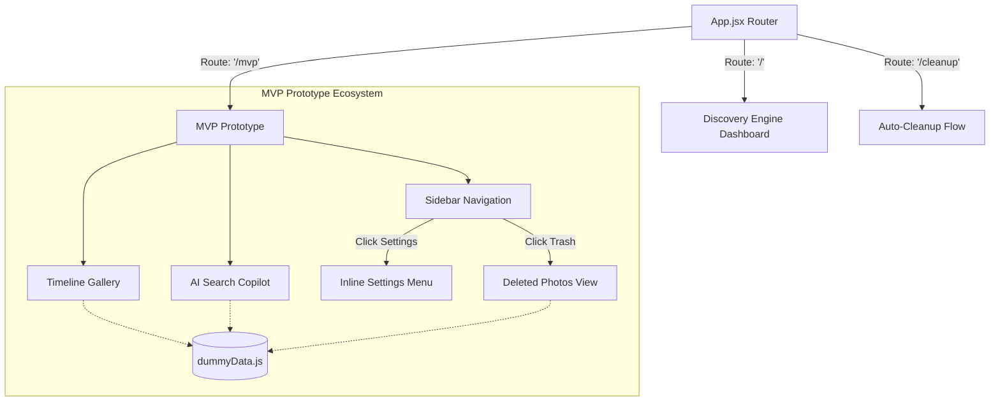

# Google Photos MVP Prototype: Architecture Document

## 1. Overview
The MVP Prototype is a static, client-side React application integrated seamlessly into the existing Vercel deployment. It serves as an interactive demonstration of how AI can solve the top user frictions identified by the Discovery Engine—specifically **Unexpected Photo Deletion** and **Search Failure**.

To ensure 100% reliability during presentations and zero impact on the live backend, the MVP relies entirely on client-side state management and deterministic mock data. It is isolated from the main application via simple client-side URL routing.

## 2. System Architecture

## 3. Core Components

### `App.jsx`
Acts as the lightweight router for the Vercel deployment. It parses `window.location.pathname` to serve either the Discovery Engine, the MVP Gallery, or the standalone Auto-Cleanup page without requiring page reloads or a complex routing library like `react-router-dom`.

### `MVP.jsx`
The flagship component of the prototype. It implements a dual-pane layout:
1. **Left Sidebar:** Houses the traditional dropdown filters (Timeline, People, Location) to demonstrate the limitations of metadata-based search. It also houses navigation modules for Settings and the Recycle Bin.
2. **Main Panel:** Houses the AI Search input, conversational chat log, and the dynamic photo gallery.
3. **Timeline Gallery:** Dynamically groups photos by `dateGroup` metadata (e.g., "September 2023", "Yesterday") and provides a sticky date scrubber on the right edge.

### `Cleanup.jsx`
A dedicated UI wizard for proactive storage management. It intercepts user frustration regarding "out of storage" warnings by offering an interactive flow to review and confirm the deletion of duplicate or inactive photos before they are wiped.

### `dummyData.js`
The backbone of the prototype. It generates 150 deterministic mock photos distributed across 15 highly specific themes (e.g., "Medical/Sick", "Goa Trip", "Meme Screenshots"). 
* **Metadata:** Injects Place, People, and Timeline tags for traditional filtering.
* **Hidden State (`syncStatus`):** Crucially, it intentionally tags 30 photos as `"In Trash"` or `"Device Only (Pending Sync)"`. These are hidden from the main gallery by default, setting up the "Aha!" moment when the AI Copilot rescues them.

## 4. State Management and Filtering
Data mutation and filtering are handled via `useState` and `useMemo` hooks. 
The `activePhotos` array is computed dynamically by passing the 150 dummy photos through multiple logic gates:
1. **Recovery Gate:** If the user asks for "lost photos", bypass traditional filters and only show photos marked as "In Trash" or "Device Only".
2. **Traditional Gate:** Filter by dropdown selections (People, Place, Timeline).
3. **AI Semantic Gate:** Filter by the tags identified by the AI Copilot's regex engine.
