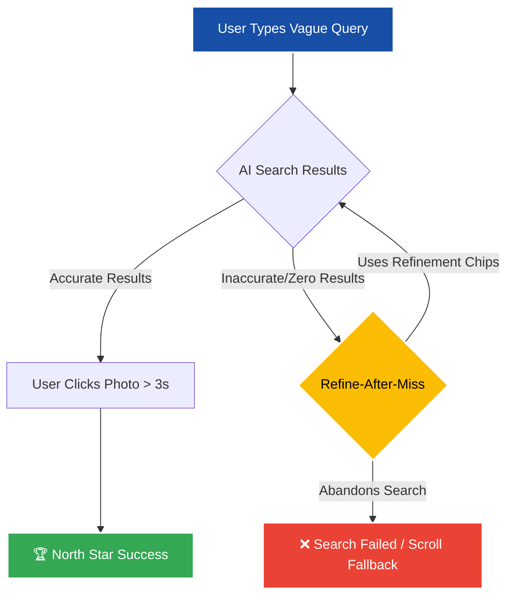
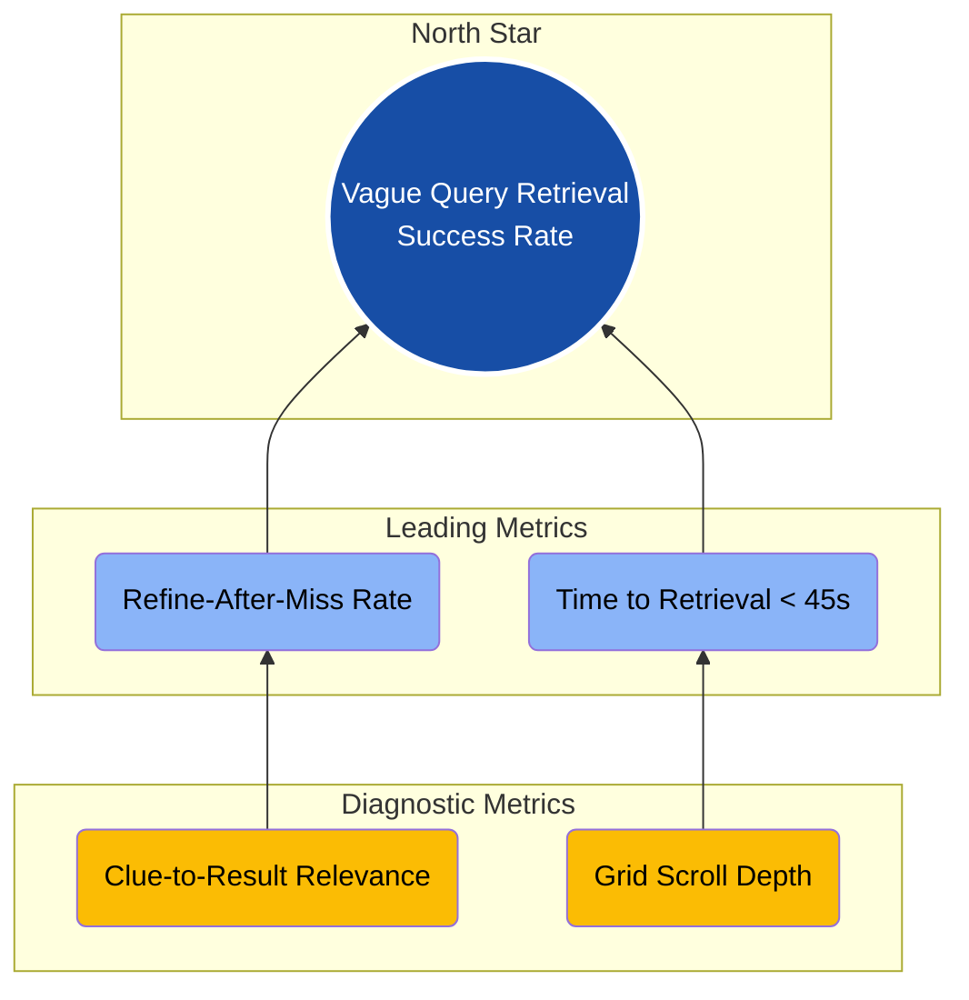

# Google Photos Discovery Engine & MVP: Success Metrics

This document outlines the metrics framework used to measure the success of the **AI Discovery Engine and MVP Prototype**. These metrics are designed to directly evaluate how well we are solving the core user problems identified in our research: *The Translation Gap* and *The Scroll Fallback*.

## 🌟 North Star Metric
**Vague Query Retrieval Success Rate**
* **Definition:** The percentage of searches utilizing contextual or vague terms (e.g., "blue shirt near the beach", "that pasta dish") that result in a photo view of >3 seconds or a share action.
* **Why it matters:** This is the ultimate indicator that our AI Memory Search is bridging the Translation Gap. If users are finding and engaging with their photos using vague, associative memories, the core product promise is fulfilled.

---

## 📈 Leading Metrics
Leading metrics help us predict if we are moving towards our North Star.

1. **Refine-After-Miss Rate:**
   * **Definition:** The percentage of users who tap a refinement chip (or use conversational narrowing) after their initial query yields no engagement.
   * **Target:** High engagement with refinement tools instead of abandoning the search.
2. **Time to Retrieval:**
   * **Definition:** Average seconds from the first keystroke to the final photo click.
   * **Target:** Reduce from >2 minutes (the current "Time Tax") to <45 seconds.

### User Search Journey & Leading Metrics

---

## 🔍 Diagnostic Metrics (Based on Metric Tree)
Diagnostic metrics help us debug *why* a leading metric might be underperforming.

1. **Clue-to-Result Relevance:**
   * **Definition:** Do the suggested refinement chips or AI interpretations match the user's actual intent?
   * **Impact:** Low relevance leads directly to "Contextual Misalignment" (H3).
2. **Grid Scroll Depth:**
   * **Definition:** How far down the filtered grid does the user scroll?
   * **Impact:** Are the AI results evaluated easily, or are users still forced into endless-scrolling even after filtering? High scroll depth indicates the AI didn't rank the correct photo highly enough.

### The Metrics Tree Hierarchy

---

## 🛡️ Guardrails
Guardrails are metrics that must not degrade while we attempt to improve the North Star.

1. **Search Latency:**
   * **Constraint:** Processing vague/conversational queries must not exceed +200ms added to the standard exact-match search latency.
   * **Why:** A slow AI search ruins the perception of the Discovery Engine.
2. **Wrong-Confidence Results:**
   * **Constraint:** The rate of zero-state returns after applying AI refinement chips must remain low.
   * **Why:** If the AI confidently suggests a chip that leads to a dead end, it severely damages user trust.
3. **Privacy:**
   * **Constraint:** Opt-out rates for AI-assisted image scanning must remain below baseline tolerances.
   * **Why:** High opt-out rates indicate that users find the deep contextual scanning invasive rather than helpful.

*(Note: Targets marked above are illustrative and will be precisely calibrated at launch).*
