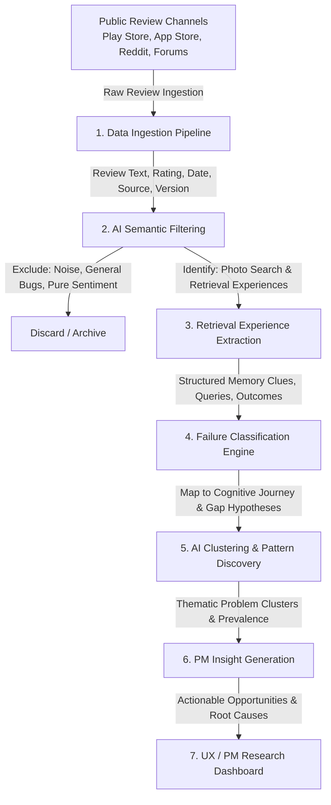

# System Context: Google Photos AI User Feedback Discovery Engine

## 1. Executive Summary & Problem Overview

### 1.1 Project Mission
Build an AI-powered user feedback discovery engine for **Google Photos** that systematically ingests, analyzes, and synthesizes publicly available user reviews to uncover recurring problems users face when searching for **vaguely remembered photos**.

### 1.2 Paradigm Shift: Beyond Sentiment Analysis
Traditional feedback monitoring merely measures whether users are satisfied or dissatisfied (e.g., star ratings, sentiment classification). This discovery engine operates at a deeper cognitive and product level:
- **Retrieval Intent:** What was the user trying to find?
- **Cognitive Memory Trace:** What fragmented details, associations, or visual cues did the user remember?
- **Failure Point:** At what exact juncture did the search and retrieval journey break down?
- **Root Cause & Workarounds:** Why did the experience fail, and what compensations (if any) did the user attempt?

---

## 2. Core Objectives

The system must:
1. **Harvest Public Feedback:** Ingest real-world user reviews from free, accessible channels without relying on paid review aggregation services.
2. **AI Semantic Filtering:** Filter out generic noise (bug reports, unrelated UI complaints, pure sentiment) to isolate reviews describing actual photo search and retrieval experiences.
3. **Structured Experience Extraction:** Extract granular dimensions of the user's memory, search attempts, and outcomes.
4. **Cognitive Journey Failure Classification:** Map every breakdown to specific failure gaps along the photo retrieval journey.
5. **Clustering & Theme Discovery:** Uncover recurring patterns, user archetypes, and thematic clusters of failure modes across the review corpus.
6. **PM-Ready Insight Generation:** Produce actionable, evidence-backed product management insights and design opportunity areas.
7. **Interactive Research Dashboard:** Visualize findings, failure distributions, verbatim quotes, and data-backed opportunities for UX researchers and product managers.

---

## 3. End-to-End System Workflow



### Stage 1: Data Ingestion
- **Free & Public Data Sources:**
  - Google Play Store reviews
  - Apple App Store reviews
  - Reddit / public discussion forums (e.g., r/googlephotos)
  - Google Photos Help Community & forum discussions
- **Ingested Attributes:**
  - `review_text`: Unprocessed raw review text.
  - `rating`: Numerical rating (1–5 stars).
  - `date`: Timestamp of review submission.
  - `source`: Platform / channel origin.
  - `app_version`: Client application version (when accessible).
- **Core Principle:** Build an authentic raw dataset without paid enterprise API dependencies.

---

### Stage 2: AI-Powered Review Filtering
The engine utilizes an LLM to distinguish between irrelevant feedback and high-value search/retrieval problem signals:

| Category | Description | Retain / Discard | Example |
| :--- | :--- | :--- | :--- |
| **Relevant Retrieval Experience** | User describes attempting to search, rediscover, or locate photos based on memories. | **Retain** | *"I remember taking a picture of the medicine I was prescribed last year, but I can't find it even though I know it's somewhere in my Photos."* |
| **General App Complaints** | Performance, storage pricing, synchronization issues, battery drain. | **Discard** | *"The app consumes too much battery in the background."* |
| **Unrelated Feature Requests** | Editing features, collage tools, sharing settings. | **Discard** | *"Please add more sticker packs to the photo editor."* |
| **Pure Sentiment** | Vague praise or frustration with no descriptive journey context. | **Discard** | *"Worst app update ever, hated the new layout."* |

---

### Stage 3: Retrieval Experience Extraction
For every review identified as relevant, the LLM extracts structured metadata capturing the user's cognitive state and behavioral actions:

- **Target Object / Subject:** What specific item, document, person, or moment was sought?
- **Memory Clues Available to User:**
  - `Object`: Physical items (e.g., pill bottle, car, receipt, jacket).
  - `Person`: Identity, relationship, or appearance (e.g., grandfather, baby).
  - `Place`: Geographic location, ambient setting (e.g., beach in Spain, kitchen, hospital).
  - `Event`: Occasion or life event (e.g., wedding, graduation, doctor's appointment).
  - `Approximate Time`: Vague temporal cues (e.g., "last summer", "around 2 years ago", "when I lived in Chicago").
  - `Text / Document`: Inscriptions, labels, serial numbers, prescription details.
  - `Visual Appearance`: Colors, lighting, angles (e.g., "blue notebook", "blurry night photo").
- **Search Attempt:** Explicit terms, keywords, voice queries, or filters attempted.
- **Search Behavior & Outcome:**
  - Immediate failure (zero results).
  - Irrelevant results (noise/false positives).
  - Information overload (too many unranked images).
- **Resolution & Workarounds:** Did they find it? If so, did they resort to endless manual scrolling, external messaging backups, or give up entirely?

#### Extraction Schema Example:
```json
{
  "review_id": "rev_1042",
  "review_text": "Can't find the photo of my old prescription from last year. Typed 'medicine' and 'pills' but nothing came up.",
  "target_entity": "Prescription / medicine document",
  "memory_clues": {
    "objects": ["medicine bottle", "prescription slip"],
    "approximate_time": "Last year (~12 months ago)",
    "category": "Document / Health",
    "visual_cues": "White label with text"
  },
  "search_attempt": "medicine, pills",
  "search_outcome": "Zero relevant results",
  "workaround_used": "Manual scrolling through month view (unsuccessful)",
  "retrieval_success": false
}
```

---

### Stage 4: Retrieval Failure Classification

#### The Photo Retrieval Journey
The user's cognitive and technical interaction follows a 6-stage funnel:
$$\text{Remember} \longrightarrow \text{Express} \longrightarrow \text{Understand} \longrightarrow \text{Retrieve} \longrightarrow \text{Recognize} \longrightarrow \text{Successful Retrieval}$$

#### The Five Core Failure Gaps (Analytical Hypotheses)
The discovery engine classifies the exact break point against five defined gaps:

```
  [User Memory]
        │
        ▼ (Stage 1: Express)
 ┌──────────────────────┐
 │ Memory Expression    │  User remembers details (e.g. emotion, vague setting) but
 │ Gap                  │  cannot formulate searchable keywords or dates.
 └──────────────────────┘
        │
        ▼ (Stage 2: Understand)
 ┌──────────────────────┐
 │ Interpretation Gap   │  User provides clues, but the search engine fails to parse
 │                      │  intended semantics, relational context, or synonyms.
 └──────────────────────┘
        │
        ▼ (Stage 3: Retrieve)
 ┌──────────────────────┐
 │ Retrieval Gap        │  System understands the query semantics, but indexing/vision
 │                      │  models fail to surface the photo in candidate results.
 └──────────────────────┘
        │
        ▼ (Stage 4: Recognize)
 ┌──────────────────────┐
 │ Recognition Gap      │  Photo is in the results, but thumbnail size, ranking, or
 │                      │  visual clutter prevents the user from recognizing it.
 └──────────────────────┘
        │
        ▼ (Stage 5: Refine)
 ┌──────────────────────┐
 │ Refinement Gap       │  Search fails, and the interface provides no guided paths,
 │                      │  filters, or conversational pivots to narrow down results.
 └──────────────────────┘
```

> **Analytical Note:** These categories serve as operational hypotheses. The discovery engine empirically validates which gaps are most prevalent in user feedback.

---

### Stage 5: AI Clustering & Pattern Discovery

The system aggregates individual extractions into recurring thematic clusters:

- **Cluster Analysis Dimensions:**
  - Theme title and concise description.
  - Quantitative frequency & proportion of total retrieval failures.
  - Typical user personas / segments (e.g., document seekers, life event nostalgics, utility photo users).
  - Predominant failure stage distribution.
  - Representative verbatim user quotes.
  - Common compensatory workarounds.

#### Example Theme Cluster:
- **Theme:** *"I know the photo exists, but I don't remember enough details."*
- **Empirical Evidence:**
  - *"I know I took a photo of it but can't remember when."*
  - *"I remember the place but not the name."*
  - *"I don't remember the exact date."*
  - *"Search doesn't find what I'm looking for."*
- **Prevalence:** High frequency in utility and document lookup scenarios.

---

### Stage 6: AI Insight Generation (PM-Ready Deliverables)

Rather than outputting superficial sentiment or word clouds, the engine outputs structured, PM-ready insights that translate UX pain into clear product hypotheses:

#### Insight Specification Template:
1. **User Situation:** Context, intent, and cognitive state of the user.
2. **Observed Behavior:** How users attempt to navigate the situation.
3. **Retrieval Failure:** Where the interaction model collapsed.
4. **Likely Underlying Problem:** Technical, algorithmic, or UX cause.
5. **Evidence Base:** Direct quotes and review citations.
6. **Prevalence / Frequency:** Statistical share within the dataset.
7. **Potential Opportunity:** High-leverage product hypothesis for further user research or prototyping.

#### Example Insight Output:
- **Observed Pattern:** Users frequently remember the contextual, episodic environment of a photo (e.g., "sitting at the patio restaurant during sunset while wearing my red jacket") but cannot recall exact dates, album titles, or formal location names.
- **Underlying Problem:** Google Photos keyword matching expects distinct entities or explicit dates rather than relational or multi-modal episodic associations.
- **Potential Opportunity:** Explore whether Google Photos can support *episodic, multi-attribute conversational retrieval* based on incomplete contextual memories rather than requiring structured keyword queries.

---

### Stage 7: Research Dashboard & Output Display

The application exposes the discovery findings through an interactive research dashboard:

1. **Volume & Yield Metrics:**
   - Total reviews harvested.
   - Total reviews classified as relevant retrieval experiences.
   - Yield percentage (% signal vs. noise).
2. **Cognitive Gap Breakdown:**
   - Distribution of failures across the 5 Gaps (Memory Expression, Interpretation, Retrieval, Recognition, Refinement).
3. **Top Thematic Clusters:**
   - Ranked list of recurring retrieval problems with frequency counts and trend indicators.
4. **Scenario & Persona Explorer:**
   - Breakdown by retrieval scenarios (e.g., Receipt/Document Search, Family Milestones, Vacation Moments, Everyday Objects).
5. **Voice of Customer (VoC) Repository:**
   - Representative quotes mapped to themes and original review sources.
6. **Workaround Log:**
   - Catalog of failed or manual workarounds adopted by frustrated users.
7. **Opportunity Matrix:**
   - Prioritized strategic opportunities for design sprints and UX research investigation.
8. **Data Traceability:**
   - Direct citations and links to original review texts and sources for auditable qualitative research.

---

## 4. Key Technical & Operational Guidelines

- **Zero-Cost Ingestion:** Rely strictly on public, free data harvesting methods (e.g., web scrapers, official store APIs where free, open RSS/public feeds, Reddit public endpoints).
- **LLM Pipeline Reliability:** Ensure prompts for filtering, extraction, and clustering enforce strict schema compliance (e.g., JSON schemas) to power downstream visualizations reliably.
- **Evidence Traceability:** Maintain an unbroken lineage from raw review $\rightarrow$ extracted attributes $\rightarrow$ journey classification $\rightarrow$ cluster $\rightarrow$ PM insight. Every high-level insight must link to supporting user quotes.
