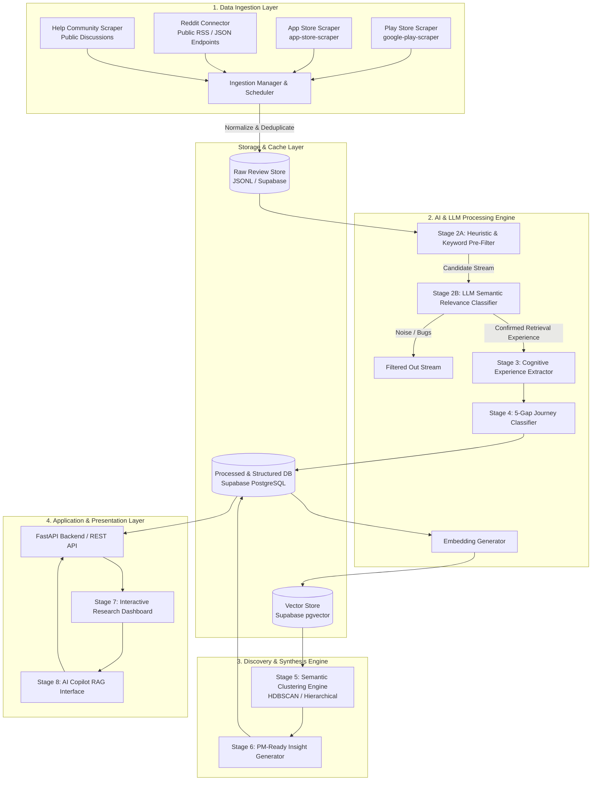
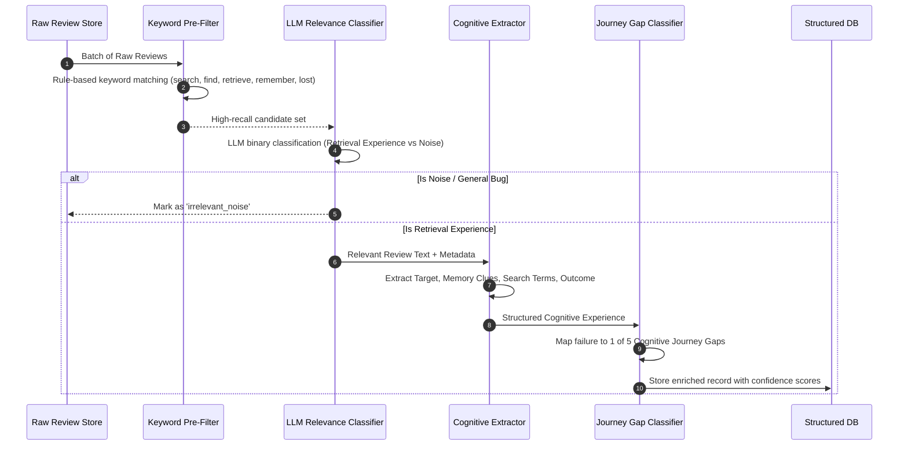
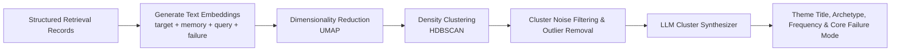
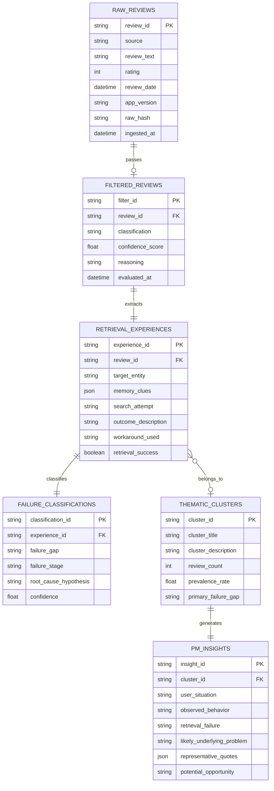

# System Architecture: Google Photos AI User Feedback Discovery Engine

## 1. Architectural Overview & Design Principles

This document defines the technical architecture for the **AI-Powered User Feedback Discovery Engine for Google Photos**. The system collects unstructured public feedback, filters and extracts structured cognitive retrieval experiences, classifies failures against a human memory-retrieval journey, clusters recurring problem patterns, and delivers PM-ready qualitative insights through an interactive research dashboard.

### 1.1 Core Architectural Principles

1. **Unbroken Data Provenance & Traceability:** Every metric, cluster, and strategic recommendation in the dashboard must be auditable down to the exact raw review quote, timestamp, and source URL.
2. **High-Throughput Groq LPU AI Pipeline:** All LLM inference (filtering, extraction, cognitive journey classification, cluster synthesis, and PM insight generation) is powered by **Groq** using its ultra-fast Language Processing Units (LPUs). Combined with deterministic heuristic pre-filtering, Groq delivers near-instant batch analysis (~250–300+ tokens/sec) with strict JSON schema compliance at low operational cost.
3. **Strict Schema Enforcement:** All LLM outputs are validated against strict type-safe schemas (Pydantic / JSON Schema) to prevent downstream pipeline crashes.
4. **Zero-Cost Ingestion Infrastructure:** Ingestion relies entirely on open-source, non-authenticated public data scrapers, RSS feeds, and free endpoints without dependencies on commercial review aggregator APIs.
5. **Decoupled Asynchronous Processing:** Data harvesting, LLM enrichment, clustering, and dashboard serving are decoupled via pipeline stages and persistent storage, allowing independent scaling, replayability, and offline iteration.

---

## 2. High-Level Architecture Diagram



---

## 3. Detailed Component & Pipeline Breakdown

### 3.1 Data Ingestion Service (`ingestion/`)

The ingestion service is implemented as a simple, lightweight set of Python modules to collect reviews without complex framework overhead:

```
src/
├── ingestion/
│   ├── play_store.py          # Google Play reviews via google-play-scraper
│   ├── app_store.py           # Apple App Store reviews via app-store-scraper (isolated interface)
│   └── reddit.py              # Reddit discussions via public JSON endpoints
├── pipeline/
│   ├── sanitize.py            # PII scrubber: runs BEFORE persist (drops handles, masks contact info + URLs)
│   ├── filter.py              # Keyword pre-filter + Groq relevance classifier (logs all rejects)
│   ├── extract.py             # Groq structured memory clue extractor (via instructor)
│   ├── classify.py            # Groq 5-gap journey classifier (primary + secondary gap)
│   ├── cluster.py             # Local sentence-transformers + sklearn.HDBSCAN clustering
│   ├── top_issues.py          # Stage 8: generates TOP_ISSUES from clusters (code-computed rankings)
│   └── orchestrator.py        # Resumable sequential pipeline runner with PIPELINE_RUNS logging
├── eval/
│   ├── golden.jsonl           # ~100 hand-labeled reviews for eval harness
│   └── run_eval.py            # Scores filter recall, gap accuracy (confusion matrix)
├── db.py                      # Supabase connection and remote database operations
└── app.py                     # FastAPI backend (Railway-hosted, no static frontend mount)
```

#### Simple Ingestion & Privacy Steps:
1. **Zero-PII Capture:** Reviewer usernames, profile URLs, and avatars are dropped **in memory before any persist**. Each record receives an anonymous sequential ID (`rev_001`, `rev_002`).
2. **Lightweight PII Masking:** A simple regex masks accidental emails, phone numbers, URLs, and `@handles` in review text before storing or sending to Groq. Note: regex does not catch names or addresses.
3. **Gentle Rate Limiting:** A simple delay (`time.sleep(1)`) between requests, with exponential backoff on 429/5xx.
4. **Basic Deduplication:** A SHA-256 hash of the normalized sanitized text prevents duplicate records across runs.
5. **Incremental Ingestion:** Existing hashes are skipped; only new rows move downstream.

---

### 3.2 AI Processing & Classification Engine (`pipeline/`)

The pipeline runs sequentially or in batched asynchronous tasks to transform raw text into structured UX intelligence.



#### Pipeline Stages:

#### Stage 2A: Heuristic & Lexical Pre-Filter
Before invoking LLM APIs, an efficient regex/keyword pre-filter checks for retrieval-related terminology:
- *Keywords:* `search`, `find`, `retrieve`, `remember`, `lost`, `lookup`, `scroll`, `where is`, `can't locate`, `disappeared`, `album`, `query`, `prescription`, `receipt`, `old photo`.
- Drops ~60-70% of pure noise (e.g., "Great app!", "App won't open", "Too many ads") at zero API cost.

#### Stage 2B: LLM Semantic Relevance Classifier
- **Engine & Model:** **Groq LPU** running `llama-3.1-8b-instant` or `llama-3.3-70b-versatile`.
- **Latency & Throughput:** Sub-second inference (<300ms per review) with deterministic temperature ($T=0.0$).
- **Task:** Classify whether the review reflects an authentic human attempt to search for, rediscover, or locate a specific photo/document/memory.
- **Classification Categories:**
  - `RETRIEVAL_EXPERIENCE` (Retain)
  - `GENERAL_APP_COMPLAINT` (Discard)
  - `UNRELATED_FEATURE_REQUEST` (Discard)
  - `GENERIC_SENTIMENT` (Discard)

#### Stage 3: Cognitive Experience Extractor
- **Engine & Model:** **Groq LPU** running `llama-3.3-70b-versatile` with native JSON mode (`response_format={"type": "json_object"}`).
- **Task:** Dissect the review into cognitive, behavioral, and technical attributes:
  - `target_entity`: What specific item or memory was sought.
  - `memory_dimensions`: Structured breakdown of available clues (Object, Person, Place, Event, Approximate Time, Document Text, Visual Characteristics).
  - `search_query_attempted`: Exact or approximated query entered.
  - `observed_outcome`: Failed completely, false positives, visual overload.
  - `workaround_behavior`: Scroll endlessly, external backup, gave up.
  - `resolution_success`: Boolean flag.

#### Stage 4: Cognitive Journey Failure Classifier
- **Engine & Model:** **Groq LPU** (`llama-3.3-70b-versatile`) with chain-of-thought rationale and structured enum output.
- Maps each failed review to the precise breaking point in the 6-stage cognitive journey:
  $$\text{Remember} \longrightarrow \text{Express} \longrightarrow \text{Understand} \longrightarrow \text{Retrieve} \longrightarrow \text{Recognize} \longrightarrow \text{Success}$$
- **[FIX]** Assigns a `primary_gap` and an optional `secondary_gap` from the 5 canonical failure gaps:
  1. `MEMORY_EXPRESSION_GAP`: User has the memory but lacks the words/metadata to express it.
  2. `INTERPRETATION_GAP`: User expressed clues, but the system misconstrued intent or context.
  3. `RETRIEVAL_GAP`: Query was understood, but indexing/computer vision failed to return candidate items.
  4. `RECOGNITION_GAP`: Item was returned in results, but visual presentation or clutter prevented user identification.
  5. `REFINEMENT_GAP`: Search failed, and the UI offered no intelligible path to pivot or narrow down.
- **[FIX]** An `INSUFFICIENT_CONTEXT` value is supported when the review lacks enough detail to determine the gap.

---

### 3.3 Semantic Clustering & Pattern Discovery Engine (`clustering/`)



1. **Composite Semantic Representation:** Constructs a dense semantic string for each review:
   `"Target: {target} | Clues: {memory_clues} | Search: {search_attempt} | Excerpt: {sanitized_user_words}"`
   **[FIX]** The Gap label is **not** included in the embedding text — clusters should emerge from behavioral patterns, not be artefacts of the gap classification.
2. **Embedding Generation:** Generates vector embeddings using 100% free, local open-source models via `sentence-transformers` (e.g., `all-MiniLM-L6-v2`), running completely on CPU with zero API costs.
3. **Clustering Algorithm:**
   - Uses **UMAP** for non-linear dimensionality reduction preserving local and global structure.
   - **[FIX]** Uses `sklearn.cluster.HDBSCAN` (scikit-learn >= 1.3) — not the standalone `hdbscan` package. `random_state`, `min_cluster_size`, and `min_samples` are exposed in config.
   - **[FIX]** Noise points (label -1) are surfaced as an **"Unclustered"** bucket — not hidden.
4. **Cluster Naming & Archetyping:**
   - Sends 5–10 representative samples per cluster (medoid-nearest + spread) to **Groq (`llama-3.3-70b-versatile`)** to generate human-readable Theme Titles, User Archetypes, and Primary Failure Modalities.
   - **[FIX]** Synthesis does not rely on a single medoid; cluster size and gap mix are included in the prompt context.

---

### 3.4 AI Insight & Opportunity Generation Engine (`insights/`)

For each validated thematic cluster, a **Groq-powered synthesis agent (`llama-3.3-70b-versatile`)** generates **PM-Ready Research Insights**:

```json
{
  "theme_id": "cluster_receipts_docs",
  "theme_title": "Unstructured Document & Prescription Lookup Failure",
  "prevalence_percentage": 24.6,
  "failure_stage": "RETRIEVAL_GAP",
  "user_situation": "User urgently needs utility information stored in a photo taken months ago (e.g., medication dosage, receipt warranty, insurance card).",
  "observed_behavior": "Enters OCR-expected keywords ('medicine', 'prescription', clinic name).",
  "retrieval_failure": "Photos app fails to perform robust OCR on angled, low-light, or handwritten text, yielding 0 results.",
  "likely_underlying_problem": "Computer vision pipeline relies primarily on prominent scene labels rather than high-recall text-in-image extraction for unstarred utility photos.",
  "representative_quotes": [
    "I took a photo of my prescription last year and searched 'medicine', but got zero results.",
    "Can never find photos of serial numbers or appliance tags when I need them."
  ],
  "potential_opportunity": "Implement automated 'Smart Document & Label Recognition' with fuzzy text matching and contextual category cards (Prescriptions, Manuals, Receipts)."
}
```

---

## 4. Complete Data Models & Database Schemas

### 4.1 Relational Schema (PostgreSQL / SQLite)



### 4.2 Pydantic Data Contracts

```python
from pydantic import BaseModel, Field
from typing import List, Optional
from enum import Enum
from datetime import datetime

class RetrievalFailureGap(str, Enum):
    MEMORY_EXPRESSION = "Memory Expression Gap"
    INTERPRETATION = "Interpretation Gap"
    RETRIEVAL = "Retrieval Gap"
    RECOGNITION = "Recognition Gap"
    REFINEMENT = "Refinement Gap"
    INSUFFICIENT_CONTEXT = "Insufficient Context"  # [FIX] Added for ambiguous reviews

class MemoryClues(BaseModel):
    objects: List[str] = Field(default_factory=list, description="Physical objects remembered")
    people: List[str] = Field(default_factory=list, description="Identities, groups, or faces")
    places: List[str] = Field(default_factory=list, description="Locations, settings, or landmarks")
    events: List[str] = Field(default_factory=list, description="Occasions, gatherings, or activities")
    approximate_time: Optional[str] = Field(None, description="Fuzzy temporal references")
    text_content: Optional[str] = Field(None, description="Words, document labels, or numbers")
    visual_cues: Optional[str] = Field(None, description="Colors, lighting, framing, composition")

class RetrievalExperienceExtraction(BaseModel):
    target_entity: str = Field(..., description="What the user was attempting to locate")
    memory_clues: MemoryClues
    search_attempt: Optional[str] = Field(None, description="Query or method used to search")
    outcome: str = Field(..., description="Observed system response")
    workaround: Optional[str] = Field(None, description="Manual or secondary action taken")
    success: bool = Field(..., description="Whether the photo was eventually retrieved")

class JourneyClassification(BaseModel):
    primary_gap: RetrievalFailureGap  # [FIX] renamed from failure_gap; primary classification
    secondary_gap: Optional[RetrievalFailureGap] = None  # [FIX] optional secondary gap
    journey_stage_breakdown: str = Field(..., description="Step where interaction failed")
    rationale: str = Field(..., description="Chain-of-thought justification")
    confidence: float = Field(ge=0.0, le=1.0)
```

---

## 5. Research Dashboard Specifications (`ui/`)

The dashboard is built as an analytical discovery workspace tailored for Product Managers and UX Researchers.

```
+----------------------------------------------------------------------------------------------------+
|  GOOGLE PHOTOS FEEDBACK DISCOVERY ENGINE : VAGUELY REMEMBERED PHOTOS                               |
+----------------------------------------------------------------------------------------------------+
| [ 2,840 Total Reviews ]  [ 412 Relevant Retrieval Reviews (14.5% Yield) ]  [ 5 Core Failure Gaps ]  |
+----------------------------------------------------------------------------------------------------+
|                                                  |                                                 |
|  RETRIEVAL JOURNEY GAP DISTRIBUTION              |  TOP THEMATIC PROBLEM CLUSTERS                  |
|  ---------------------------------               |  -----------------------------                  |
|  [■■■■■■■■■■] 38% Memory Expression Gap          |  1. "Lost in Time": Inability to anchor date    |
|  [■■■■■■]     24% Interpretation Gap             |  2. "Prescription & Doc Lookup": OCR failure    |
|  [■■■■■]      19% Retrieval Gap                  |  3. "Visual Recall vs Text Queries": Color/Atm  |
|  [■■■]        12% Refinement Gap                 |  4. "Pet / Face Confusion": False grouping      |
|  [■]           7% Recognition Gap                |  5. "Event Blurring": Multi-day vacation photo  |
|                                                  |                                                 |
+--------------------------------------------------+-------------------------------------------------+
|                                                                                                    |
|  DEEP DIVE: CLUSTER DRILLDOWN & PM INSIGHT CARD                                                    |
|  ----------------------------------------------                                                    |
|  Theme: "Visual Recall vs Keyword Search Barrier" (22.4% Prevalence | Gap: Memory Expression)       |
|                                                                                                    |
|  • User Situation: User remembers emotional/visual scene (red jacket at sunset) but not venue/date.|
|  • Observed Behavior: Enters vague keywords ("sunset winter red coat") and receives zero matches. |
|  • Underlying Cause: Semantic search requires concrete entity tags or exact dates.                 |
|  • Potential Opportunity: Episodic multimodal search supporting multi-attribute fuzzy context.    |
|                                                                                                    |
|  Representative Evidence:                                                                          |
|  - "I remember my dog wearing a little yellow bandana at the lake, but search shows nothing."      |
|    [App Store | Rating: 2★ | 2026-08-14 | View Source ↗]                                          |
|                                                                                                    |
+----------------------------------------------------------------------------------------------------+
|  EXPLORER: FILTERABLE REVIEW EVIDENCE REPOSITORY                                                   |
|  Filters: [Source: All ▼] [Failure Gap: All ▼] [Theme: All ▼] [Rating: All ▼] [Search: ________]  |
|  +-----------------------------------------------------------------------------------------------+ |
|  | Review Quote                  | Memory Clues         | Search Attempt | Failure Gap | Source   | |
|  | "Can't find old receipt..."   | White receipt, 2025  | "Home Depot"   | Retrieval   | PlayStore| |
|  +-----------------------------------------------------------------------------------------------+ |
+----------------------------------------------------------------------------------------------------+
```

### Dashboard Panels:
1. **Executive Yield Bar:** High-level metrics tracking total intake, extraction yield, and quality scores.
2. **Source Breakdown Badges:** Explicit pill badges showing exact review counts ingested per source (e.g., Play Store, Reddit).
3. **[FIX] Failure Distribution (renamed from "Cognitive Journey Funnel"):** Interactive distribution chart showing counts per primary gap, with secondary-gap overlay and toggle between % Share vs. Mentions. Labeled clearly as a **distribution**, not stage-to-stage drop-off.
4. **Thematic Cluster Explorer:** Clustered problem sets ranked by frequency. **[FIX]** Includes an "Unclustered" card for HDBSCAN noise.
5. **PM-Ready Insight Inspector:** Comprehensive card displaying the user situation, behavior, root cause, and prioritized design opportunities.
6. **Traceable Voice of Customer (VoC) Table:** Filterable, sortable repository of reviews. Gap badges include text labels (not color-only). **[FIX]**
7. **[FIX] Interactive AI Copilot (Chat Interface):** A dedicated RAG-powered chat window driven by Groq Llama 3.3, grounded in live data. Suggestion chips are Google Photos retrieval-specific (e.g., "Top search failures", "Can't find old photos"). Shows citations and "insufficient data" replies. Accessed via Vercel serverless proxy — API key is never exposed to the browser.

---

## 6. Resilience, Scalability & Guardrails

### 6.1 Groq Throughput & Rate Limit Optimization Strategy
- **Two-Pass Filtering:** Reject 60%+ of non-retrieval reviews via fast keyword pre-filters before invoking Groq APIs.
- **Model Tiering on Groq:** Use `llama-3.1-8b-instant` for ultra-fast Stage 2B relevance filtering, reserving `llama-3.3-70b-versatile` for complex Stage 3 extraction, Stage 4 classification, and Stage 6 insight synthesis.
- **Groq Rate-Limit & Backoff Manager:** Implement a token-bucket rate limiter that respects Groq API limits (RPM / TPM) with exponential backoff and jitter.
- **Strict Temperature Settings:** Set $T = 0.0$ on Groq calls for extraction and classification to maximize deterministic, schema-compliant JSON outputs.

### 6.2 Hallucination Guardrail & Citation Verifier
- The extraction engine enforces that any quote displayed in the PM Insight or dashboard **must be a verbatim substring** of the original review text.
- An automated assertion check invalidates any extracted quote that fails string matching against the raw review store.

### 6.3 Privacy & Data Anonymization Guardrails (Simple & Compliant)
To ensure complete compliance with GDPR and privacy best practices without complicating the code:
- **Rule 1 (No Real Usernames):** Drop reviewer handles, display names, and profile avatars at the scraper boundary. Only store synthetic IDs (`rev_001`, `rev_002`).
- **Rule 2 (Inline Regex Sanitization):** Run a two-line regex scrubber before saving or passing text to Groq:
  - Mask emails: `re.sub(r'[\w\.-]+@[\w\.-]+', '[EMAIL]', text)`
  - Mask phone numbers: `re.sub(r'\+?\d[\d -]{8,12}\d', '[PHONE]', text)`
- **Rule 3 (Aggregated Insights Only):** The dashboard exclusively presents aggregated thematic clusters and anonymized quotes. No individual profiling is ever performed.
- **Rule 4 (Groq Zero-Retention Policy):** Groq API does not use inputs/outputs for model training and provides stateless processing.
- **Rule 5 (Scraping Politeness):** Only access public endpoints, respect `robots.txt`, and use simple request delays (1s) to avoid server load.

---

## 7. Recommended Technology Stack

| Layer | Recommended Technology | Rationale |
| :--- | :--- | :--- |
| **LLM Inference Provider** | **Groq Cloud (LPU Inference Engine)** | Industry-leading inference speed (~250–300+ tokens/sec), ultra-low latency, native JSON Mode, and cost-effective batch analysis. |
| **LLM Models (Groq)** | `llama-3.3-70b-versatile`<br>`llama-3.1-8b-instant` | 70B model for high-reasoning extraction, classification & insight generation; 8B model for high-speed relevance filtering. **Model IDs read from config/env.** |
| **Backend & Services** | Python 3.11+, FastAPI | Native async support, high performance, clean REST endpoints. Hosted on **Railway** via Dockerfile. |
| **Data Validation & Schemas**| Pydantic v2, `groq` SDK / `instructor` | Type-safe structured outputs. `instructor` owns JSON mode — do not set `response_format` manually. |
| **Vector & Clustering** | `sentence-transformers` (`all-MiniLM-L6-v2`), Scikit-learn (HDBSCAN), UMAP-learn | 100% free, runs locally on CPU; `sklearn.cluster.HDBSCAN` (no standalone package). |
| **Database** | Supabase (PostgreSQL + pgvector) | Cloud-hosted relational DB with `PIPELINE_RUNS`, `TOP_ISSUES`, and review tables. Row-level security enabled. |
| **Chat Retrieval** | In-memory NumPy cosine similarity | At 1,000–2,000 reviews, <50MB RAM; millisecond search. No pgvector config needed for MVP. |
| **Scraping Tools** | `google-play-scraper`, `app-store-scraper` (isolated interface), `httpx`, `BeautifulSoup4` | Open-source, zero-cost, lightweight connectors. |
| **Frontend UI** | **Vite + React + Recharts** | Static build deployed on **Vercel**. FastAPI does not serve the frontend. `VITE_API_BASE_URL` baked in at build time. |
| **Auth / Secret Protection** | Vercel Serverless Proxy (`frontend/api/`) | Injects `API_KEY` server-side for `/pipeline/run` and `/chat`; browser never receives secrets. |
| **Backend Hosting** | **Railway** (Dockerfile, CPU-only) | Embedding model pre-baked into image; `GET /health` for health checks; ephemeral disk — all state in Supabase. |
